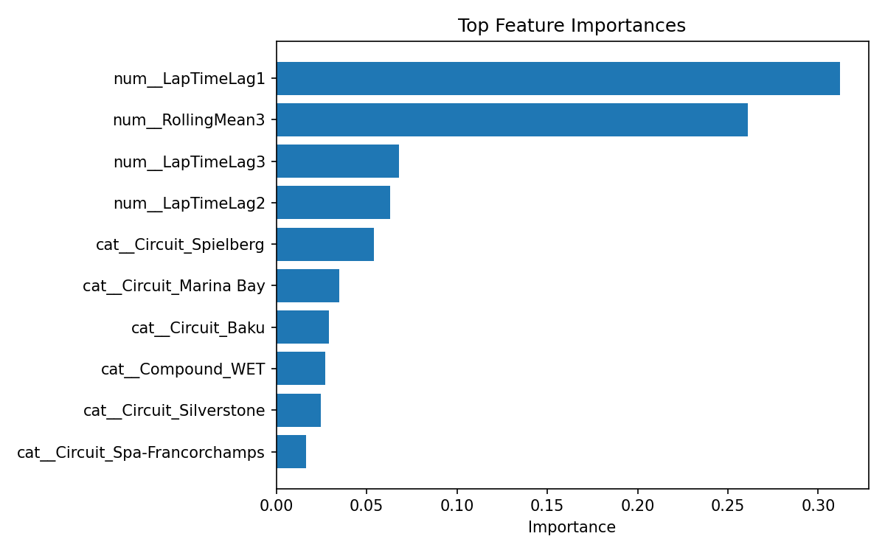
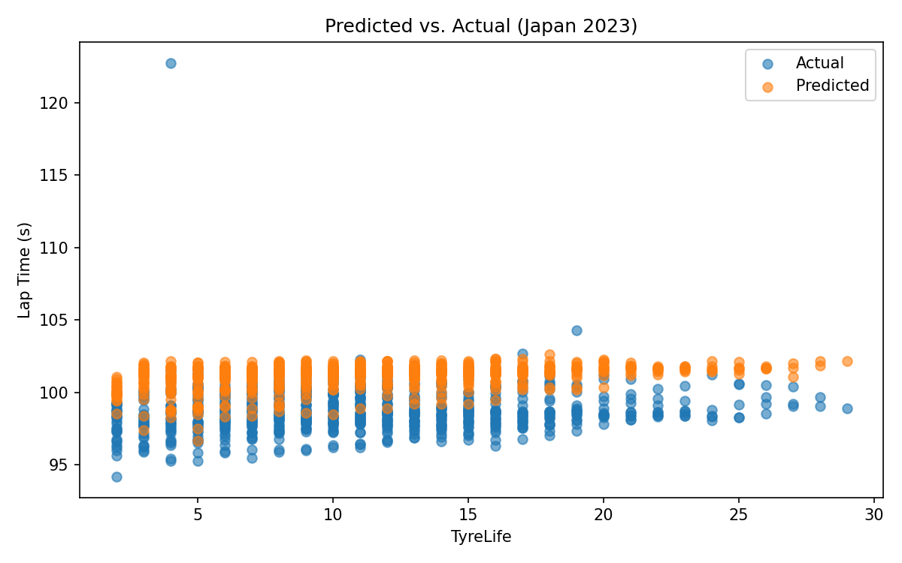

# ml_f1 — F1 Lap Time Prediction

Predict F1 race lap times from FastF1 data, with a reproducible pipeline and a set of comparison notebooks (linear → tree ensembles → XGBoost → PyTorch MLP).

## Results (example figures)

<p align="center">
  
</p>

<p align="center">
  
</p>

## Quickstart

```bash
python -m venv .venv
.\.venv\Scripts\activate
pip install -r requirements.txt
```

Then open and run the notebooks in order:

- `notebooks/01_data_pipeline.ipynb` — download + clean data, build feature table
- `notebooks/02_model_linear.ipynb`
- `notebooks/03_model_random_forest.ipynb`
- `notebooks/04_model_xgboost.ipynb` — also exports the figures shown above
- `notebooks/05_model_mlp.ipynb`
- `notebooks/06_model_pytorch_mlp_extensive.ipynb`
- `notebooks/07_mlp_systematic_improvement.ipynb`

## Notes

- The first data download requires internet access; subsequent runs use FastF1’s on-disk cache.
- Large caches are intentionally ignored via `.gitignore` (e.g. `notebooks/data/cache/`).
